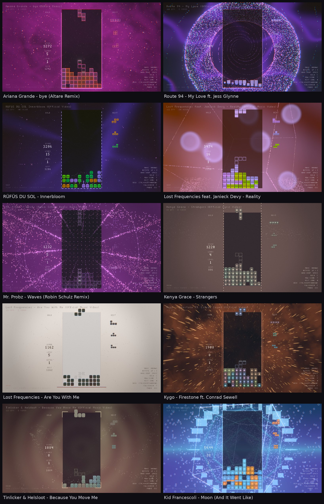

# Zentris

A Tetris game inspired by **Tetris Effect**, but playing **any playlist you like**: your own music folder or
a YouTube playlist. Each song is analysed ahead of time (tempo, key, structure: intro, verse, build,
chorus, drop...) and the game stages it: pieces fall on the beat, the pace follows the song's energy, and
a procedurally generated 3D scene evolves with every section. Built in C++ / OpenGL 3.3.



*Nine scenes generated by the game. Every song, and every run, gets its own scene.*

## Install

[](https://pypi.org/project/zentris/)

Prebuilt packages for Linux, macOS (Intel and Apple Silicon) and Windows are on
[PyPI](https://pypi.org/project/zentris/).

Run it directly with [uv](https://docs.astral.sh/uv/), without installing:

```sh
uvx zentris                              # the default playlist
uvx zentris ~/Music
uvx --from zentris zenscope ~/Music      # the analysis viewer
```

Or install it with [pipx](https://pipx.pypa.io/) (or `uv tool install zentris`):

```sh
pipx install zentris
zentris                     # with no argument it plays the default YouTube playlist
zentris ~/Music             # or any folders, files and YouTube playlist/video URLs
zenscope ~/Music            # the analysis viewer
```

Quote YouTube URLs: `&` is special in the shell. The package brings [yt-dlp](https://github.com/yt-dlp/yt-dlp)
and an ffmpeg build for YouTube playlists; YouTube also needs a JavaScript runtime
([Deno](https://deno.com) or Node.js) on your system.

## Build from source

Dependencies (Debian/Ubuntu): `sudo apt install cmake g++ libglfw3-dev libglew-dev`
(miniaudio and stb are vendored in `third_party/`).

```sh
cmake -S . -B build && cmake --build build -j
./build/zentris audio           # plays every .mp3/.wav/.flac in ./audio, in random order (--in-order to keep it)
./build/zentris song.mp3 ~/Music --fullscreen
```

YouTube playlists (or single videos) work too, through [yt-dlp](https://github.com/yt-dlp/yt-dlp)
(install it with `pipx install "yt-dlp[default]"`; YouTube also needs a JavaScript runtime such as Deno or
Node.js, and Node.js is picked up automatically). Songs are downloaded when queued and cached as MP3 in
`~/.cache/zentris/youtube/`. Downloading from YouTube is against its terms of service: personal use only.

```sh
./build/zentris "https://www.youtube.com/playlist?list=PLWHPu2N_Gb2lbZ8-7sYKSEbDlb3UiAVye"   # quote it: & is special in the shell
./build/zenscope "https://www.youtube.com/watch?v=..."
```

Other options: `--in-order` (play songs in order: folders alphabetically, playlists in their order; the default is a random order), `--seed N` (repeat a run), `--scene CODE` (show again the scene whose code is in the bottom-left corner; the terminal prints the full command, with the song), `--autoplay`, `--mute`, `--size WxH`,
`--shots PREFIX N` (renders N screenshots of different scenes and exits), `--phase-shots PREFIX` (one screenshot per scene level of a song),
`--clip OUT.mp4` (records a video with sound, via ffmpeg, from 4 s before the first drop of the song to 6 s after it,
with the game played at a calm pace; `--clip-before` / `--clip-after SEC` change the span).

`tools/promo.py [OUT.mp4]` makes a promo video: 5 random songs of the default playlist, each recorded around its
first drop in a random scene, stitched with crossfades (`--songs N`, `--before`, `--after`, `--fade`, `--size`).

## zenscope: see what the game hears

`./build/zenscope [songs or folders...]` (the default playlist when no song is given) plays a song and shows the analysis that drives the game:
- a phase timebar with the scene levels (calm / mid / peak) and where the scene changes happen
- the detected structure: intro, verse, build, chorus, drop, break, outro, with similar parts grouped
- pulse zones, a 16-band spectrum, loudness, intensity and onsets, and bar lines
- a live readout of the current section and the game's density/speed/glow profile, with the beat in the bar
- a zoomed detail view with the beat grid
- four beat-aligned samples cut from the song (an experiment for line clears, not used by the game yet):
  HIT (one clean transient, 1 beat), LOW (a bass-led half bar), TONE (a sustained, steady half bar) and
  HOOK (the first bar of the most repeated chorus/drop)

Space plays/pauses, Left/Right seek 5 s, Up/Down zoom the detail view, N/P change song, click to seek,
1–4 or a click on a sample button plays that sample (over the song, or alone when paused).
The SPEED buttons (top right) slow the song down to ×0.9 or ×0.5, tape-style (the pitch drops too);
click the active one again to go back to normal speed.

**Notes:** press A to write a note at the playhead (e.g. "the drop should start earlier here"); Enter saves it,
Esc cancels (the song pauses while you type). Notes go to `annotations.jsonl` in the user data folder
(`~/.local/share/zentris/` on Linux; `--notes FILE` to change it), one JSON object per line with the song, the time,
the text and what the analysis said there (the phase and section, and the whole scene plan and structure).
They show as cyan flags on the timeline, with their text in the detail view.
`--song ID|TITLE` starts at a song of the playlist (a YouTube id or part of its title), `--at SEC` at a time, and
`ytdl:<video id>` plays a single YouTube song, and `--shuffle` plays the songs in a random order. Playlist listings are cached (and refreshed in the background for the
next run) and songs stay downloaded in the cache, so reopening an annotated song is instant and works offline.

The game and zenscope share the same analysis and song plan code (`src/songplan.*`), so what you see is what the game uses.

## Controls

Keyboard and gamepad both work at the same time. A gamepad is detected at startup and on hot-plug,
and the on-screen hints follow whichever device you used last.
Controllers are recognised through the bundled [SDL_GameControllerDB](https://github.com/mdqinc/SDL_GameControllerDB)
(`third_party/gamecontrollerdb.txt`; extra mappings can be given in `SDL_GAMECONTROLLERCONFIG`). A controller
missing from it still works with a generic layout.

| Action | Keyboard | Gamepad |
|---|---|---|
| Move | ← → | D-pad / left stick |
| Soft / hard drop | ↓ / Space | Down / Up |
| Rotate | ↑ or X (Z or J to rotate left) | A (B/X to rotate left) |
| Hold | C / Shift (tap) | LB / RB |
| Slow motion (when the gauge is full) | V / E | ZL / ZR (LT / RT) |
| New scene | T | Y |
| Next song | N / Tab / Enter / PageDown | Back |
| Seek ±10 s in the song (testing) | Ctrl+Shift+Left/Right | |
| Next level (debugging) | L | |
| Fill the bonus gauge (testing) | B | |
| Pause | Esc / P (Q quits while paused) | Start |
| Fullscreen | F / F11 | |

## Slow motion and Tetris rewards

Each cleared line charges one step of the bonus gauge, a ring below the next pieces (12 steps to fill it; a
Tetris charges 5). Once it's full, the slow-motion button starts the bonus: for 10 s the gauge drains, the
game slows down to ×0.25 (pieces fall four times slower) while the song keeps playing normally: only a very
slight tape-like slow-down (and back) marks the start and the end. Use it to clean up the stack in a part that's too fast. Gravity gets
back on the beat when the bonus ends. Meanwhile the screen's colors are reversed (swept in and out from the
board) and the scene slows down, with one animation from a pool (halo, hourglass, ripples, orbits, stasis,
ribbons, clock).

A Tetris scores a 400-point bonus (800 back-to-back) and plays a celebration from another pool (pillars,
blooms, spiral, waves, starfall, frame trace, light sheet); a back-to-back Tetris plays two at once.

## How the music shapes the game

Each song is decoded and analyzed in the background (under 1 s):

- **Tempo and song sections**: gravity follows the beat, at a pace set by the current section, in rows per beat: break ×0.4, intro ×0.5, outro ×0.5, verse ×0.8, build ×1, chorus ×1.2, drop ×1.3 (at most ×1 in a song's first 20 s).
- **Levels**: one level per 20 lines, up to a plateau at level 20. Each level speeds up the beat-locked gravity (×10 at the plateau, capped at 28 rows/s) and shortens the lock delay (0.55 s → 0.35 s). Game over resets the level.
- **Key**: the base hue follows the circle of fifths.
- **Brightness, bass/air balance, dynamics, density**: choose the mood (night, dusk or pale), the particle layouts, bloom, how strongly things react, and the camera's motion.
- **Song structure**: the song is split at bar lines into labelled segments (intro, verse, build, chorus, drop, break, outro), and segments that sound alike are grouped. A section that gets louder starts where it lands, on the first beat where its bass and loudness are back (after the gap, bass cut or riser before a drop), and a drop is the song's most intense material entered by a rise. Each segment eases the scene's density, speed, glow and saturation (builds ramp up, breaks thin out).
- **One identity per song**: background, main particles, blocks, frame and mood stay the same for the whole song. At most three intensity levels (calm, mid, peak) shift the hue slightly and add color, glow or an extra particle layer. Changes happen only when the level changes, crossfading over 8 s, and never interrupt each other.
- **Calm by design**: visuals follow slow (~1 s) envelopes of the music and there is no camera shake or flashing. Beat pulses appear only during peak sections (choruses, drops), stronger for faster songs; songs above ~110 BPM also get soft hits on strong transients there.
- **Live bands and loudness**, heavily smoothed, drive particle motion and glow.

The scene seed combines the song's fingerprint with a random seed for each run, so the same song looks
different every time. The combinatorial space covers 8 palette schemes × 3 moods, 24 backgrounds,
44 particle layouts (elements like rain, wind, fire and sea; some shaped by the live spectrum: skyline, corona, dunes, wall, halos) × 20 particle shapes (none, one or two layers), 17 continuous surface layers (smoke, silk, lava, caustics, ink, geometry, aurora, fog, beams, flowing rings, liquid, cloud shades, voronoi cells, water, low-poly facets, hexagon tiles, glass shards), 22 block materials × a continuous family of
block shapes (cube → rounded → sphere → gem), 18 board frames, light rays, 22 line-clear effects, 25 transition shapes, and a
post-processing grade (bloom, vignette, chromatic aberration, grain, split-toning).
The scene name is shown in the bottom-left corner.

## Releasing

`.github/workflows/wheels.yml` builds wheels for Linux (x86_64, aarch64), macOS (x86_64, arm64) and
Windows (x86_64) plus a source distribution on every push, and publishes them to PyPI when a `v*` tag is
pushed (`git tag v0.1.0 && git push --tags`). Publishing uses PyPI trusted publishing: on pypi.org, add a
publisher for project `zentris`, repository `Gregwar/zentris`, workflow `wheels.yml`, environment `pypi`.
